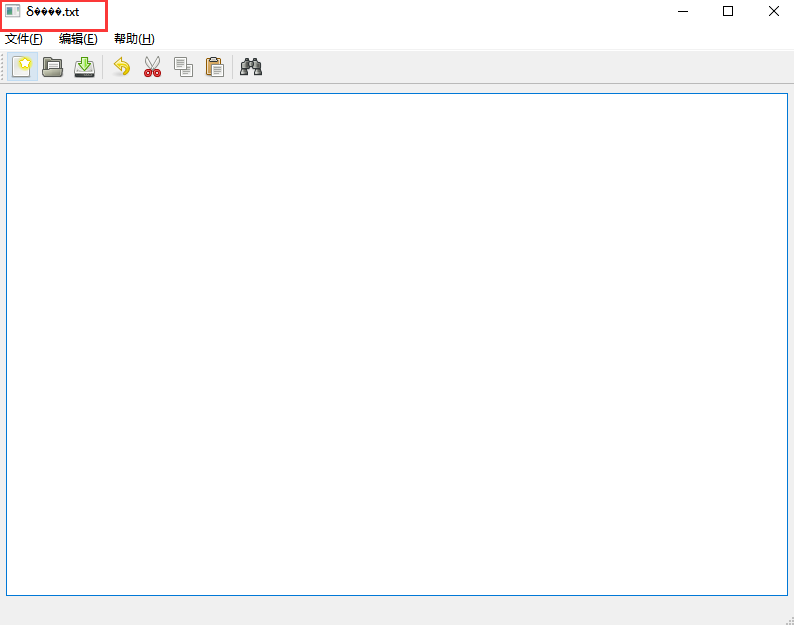

Qt中的中文显示，经常会出现乱码。从网上看了一些博客，大都是Qt4中的解决方法，
网上搜到的都是这种：
```

#include < QTextCodec >
int main(int argc, char **argv)
{
....................
QTextCodec::setCodecForTr(QTextCodec::codecForName("UTF8"));
QTextCodec::setCodecForLocale(QTextCodec::codecForName("UTF8"));
QTextCodec::setCodecForCStrings(QTextCodec::codecForName("UTF8"));
..........................

}
```

Qt5中， 取消了QTextCodec::setCodecForTr()和QTextCodec::setCodecForCString()这两个函数，而且网上很多都是不推荐这种写法。

### 我的问题

代码：
```

#include "mainwindow.h"
#include "ui_mainwindow.h"
#include <QMessageBox>
#include <QPushButton>
#include <QFileDialog>
#include <QTextStream>
#include <qstring.h>
MainWindow::MainWindow(QWidget *parent)
    : QMainWindow(parent)   
    , ui(new Ui::MainWindow)
{    
    ui->setupUi(this);    
    
    isUntitled = true;  // 初始化文件为未保存状态    
    curFile = tr("未命名.txt");// 初始化文件名为"未命名.txt"    
    setWindowTitle(curFile);// 初始化窗口标题为文件名
}
```
### 结果




### 解决方法

#### 方案1
添加头文件
#include <qstring.h>
修改代码
curFile = QStringLiteral("未命名.txt");// 初始化文件名为"未命名.txt"

结果如下


#### 方案2

修改此行代码为
curFile = QString::fromLocal8Bit("未命名.txt");// 初始化文件名为"未命名.txt"

结果如下

