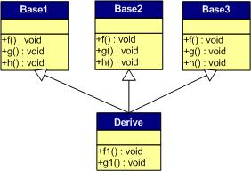

## C++虚函数详解
### 前言

C++的特性使得我们可以使用函数继承的方法快速实现开发，而为了满足多态与泛型编程这一性质，C++允许用户使用虚函数 (virtual function) 来完成 运行时决议 这一操作，这与一般的 编译时决定 有着本质的区别。
### 虚函数表实现原理

虚函数的实现是由两个部分组成的，虚函数指针与虚函数表。
#### 虚函数指针

虚函数指针 (virtual function pointer) 从本质上来说就只是一个指向函数的指针，与普通的指针并无区别。它指向用户所定义的虚函数，具体是在子类里的实现，当子类调用虚函数的时候，实际上是通过调用该虚函数指针从而找到接口。

虚函数指针是确实存在的数据类型，在一个被实例化的对象中，它总是被存放在该对象的地址首位，这种做法的目的是为了保证运行的快速性。与对象的成员不同，<u>**虚函数指针对外部是完全不可见的**</u>，除非通过直接访问地址的做法或者在DEBUG模式中，否则它是不可见的也不能被外界调用。

只有拥有虚函数的类才会拥有虚函数指针，每一个虚函数也都会对应一个虚函数指针。所以拥有虚函数的类的所有对象都会因为虚函数产生额外的开销，并且也会在一定程度上降低程序速度。与JAVA不同，C++将是否使用虚函数这一权利交给了开发者，所以开发者应该谨慎的使用。
### 虚函数表

上文已经提到，每个类的实例化对象都会拥有虚函数指针并且都排列在对象的地址首部。而它们也都是按照一定的顺序组织起来的，从而构成了一种表状结构，称为虚函数表 (virtual table) 。
先规定一个基类：
```
class Base
{
    public:
    virtual void f(){cout<<"Base::f"<<endl;}
    virtual void g(){cout<<"Base::g"<<endl;}
    virtual void h(){cout<<"Base::h"<<endl;}
};
```

首先对于基类Base它的虚函数表记录的只有自己定义的虚函数


接下来我们来看看子类的情况
```
class Derived:public Base
{
        public:
    virtual void f(){cout<<"Derived::f"<<endl;}
    virtual void g1(){cout<<"Derived::g1"<<endl;}
    virtual void h1(){cout<<"Derived::h1"<<endl;}
}
```

一般覆盖继承首先是最常见的继承，子类Derived对基类的虚函数进行覆盖继承，在这个例子中仅设计了一个函数继承的情况以此推广情况。


那么此时情况是这样的：


首先基函数的表项仍然保留，而得到正确继承的虚函数其指针将会被覆盖，而子类自己的虚函数将跟在表后。而当多重继承的时候，表项将会增多，顺序会体现为继承的顺序，并且子函数自己的虚函数将跟在第一个表项后。



C++中一个类是公用一张虚函数表的，基类有基类的虚函数表，子类是子类的虚函数表，这极大的节省了内存。

## 同名覆盖原则与const修饰符

如果继续深入下去的话我们将会碰见一个有趣的状况
```

class Base
{
public:
        virtual void func()const
        {
                cout << "Base!" << endl;
        }
};
class Derived :public Base
{
public:
        virtual void func()
        {
                cout << "Derived!" << endl;
        }
};

void show(Base& b)
{
        b.func();
}
Base base;
Derived derived;

int main()
{
        show(base);
        show(derived);
        base.func();
        derived.func();
        return 0;
}
```

在上述程序中我们将Base类中的虚函数base定义为const类型，我们知道const后缀的目的是为了限定该函数不对类内成员做出修改。然后我们分别声明base与derived并且通过show函数调用它们的func函数，子类传参给父类也是非常正常的一个操作，但是结果可能却令人不解：
```
Base!
Base!
Base!
Derived!
```

这里有一个很大的问题，因为当我们将derived传过去的时候并没有调用derived的虚函数！也就是说虚函数不再是多态的了。
但是这样的话我们只需要简单的修改任意一项：将line4结尾的const限定符去掉或者将Derived的func1后加上const便可以使一切正常。这是为什么呢？
很多其他的博客将其解释为是const符号作用的原因，但实际上这样的解释并不正确。
正确的原因是:虚函数的声明与定义要求非常严格，只有在子函数中的虚函数与父函数一模一样的时候（包括限定符）才会被认为是真正的虚函数，不然的话就只能是重载。这被称为虚函数定义的同名覆盖原则，意思是只有名称完全一样时才能完成虚函数的定义。
因此在上述的例子中，将Derived类型的子类传入show函数时，实际上类型转化为了Base，由于此时虚函数并未完成定义，Derived的func()此时仅仅是属于Derived自己的虚函数，所以在show中b并不能调用，而调用的是Base内的func。而当没有发生类型转换的时候，Base类型与Derived类型就会各自调用自己的func函数。