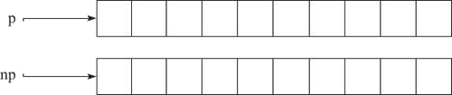
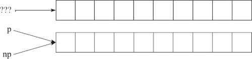
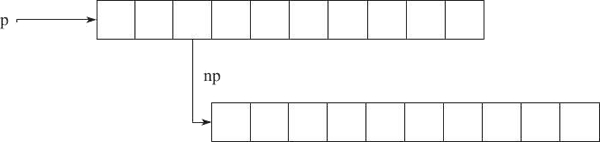

**内存泄漏（Memory Leak）**：是指程序中己动态分配的堆内存由于某种原因程序未释放或无法释放，造成系统内存的浪费，导致程序运行速度减慢甚至系统崩溃等严重后果。在堆上分配的内存，如果不再使用了，就应该及时释放，以便后面其他地方可以重用。而在 C 语言中，内存管理器不会自动回收不再使用的内存。如果忘了释放不再使用的内存，这些内存就不能被重用了，这就造成了内存泄漏。内存泄漏缺陷具有隐蔽性、积累性的特征，比其他内存非法访问错误更难检测。因为内存泄漏的产生原因是内存块未被释放，属于遗漏型缺陷而不是过错型缺陷。此外，内存泄漏通常不会直接产生可观察的错误症状，而是逐渐积累，降低系统整体性能，极端的情况下可能使系统崩溃。内存泄漏几乎是很难避免的，不管是老手还是新手，都存在这个问题，甚至 Windows 与Linux这类系统软件也或多或少存在着内存泄漏。也许对一般的应用软件来说，这个问题似乎不是那么突出与严重。一两处内存泄漏通常并不致于让程序崩溃，也不会带来逻辑上的错误，而且在进程退出时，系统会自动释放所有与该进程相关的内存（共享内存除外），所以内存泄漏的后果相对来说还是比较温和的。但是，量变会导致质变，一旦内存泄漏过多以致耗尽内存，后续内存分配将会失败，程序就可能因此而崩溃。
在常见情况下，内存泄漏的主要可见症状就是罪魁进程的速度减慢。原因是体积大的进程更有可能被系统换出，让别的进程运行，而且大的进程在换进换出时花费的时间也更多。即使泄漏的内存本身并不被引用，但它仍然可能存在于页面中（内容自然是垃圾），这样就增加了进程的工作页数量，降低了性能。

**导致内存泄漏的常见场景有以下几种：**

**1) 指针重新赋值**

看下面一段示例代码：
```
char * p = (char *)malloc(10);
char * np = (char *)malloc(10);

```
其中，指针变量 p 和 np 分别被分配了 10 个字节的内存，它们各自的内存如图 1 所示。


如果程序需要执行如下赋值语句：
```
p=np;
```

这时候，指针变量 p 被 np 指针重新赋值，其结果是 p 以前所指向的内存位置变成了孤立的内存，如图 2 所示。它无法释放，因为没有指向该位置的引用，从而导致 10 字节的内存泄漏。


因此，在对指针赋值前，一定确保内存位置不会变为孤立的。

**2) 错误的内存释放**

假设有一个指针变量 p，它指向一个 10 字节的内存位置。该内存位置的第三个字节又指向某个动态分配的 10 字节的内存位置，如图 3 所示。

假设有一个指针变量 p，它指向一个 10 字节的内存位置。该内存位置的第三个字节又指向某个动态分配的 10 字节的内存位置，如图 3 所示。



如果程序需要执行如下赋值语句时：
```
free(p);
```

很显然，如果通过调用 free 来释放指针 p，则 np 指针也会因此而变得无效。np 以前所指向的内存位置也无法释放，因为已经没有指向该位置的指针。换句话说，np 所指向的内存位置变为孤立的，从而导致内存泄漏。
因此，每当释放结构化的元素，而该元素又包含指向动态分配的内存位置的指针时，应首先遍历子内存位置（如本示例中的 np），并从那里开始释放，然后再遍历回父节点，如下面的代码所示：
```
free(p->np);
free(p);
```

**3) 返回值的不正确处理**

有时候，某些函数会返回对动态分配的内存的引用，如下面的示例代码所示：
```
char *f()
{
    return (char *)malloc(10);
}
void f1()
{
    f();
}
```
很明显，函数 f1 中对 f 函数的调用并未处理该内存位置的返回地址，其结果将导致 f 函数所分配的 10 个字节的块丢失，并导致内存泄漏。

**4) 在内存分配后忘记使用 free 进行释放**

最后，要避免这些内存相关的问题导致的内存越界与内存遗漏等错误，可以参考如下几点进行：

1. 确保没有在访问空指针。
2. 每个内存分配函数都应该有一个 free 函数与之对应，alloca 函数除外。
3. 每次分配内存之后都应该及时进行初始化，可以结合 memset 函数进行初始化，calloc 函数除外。
4. 每当向指针写入值时，都要确保对可用字节数和所写入的字节数进行交叉核对。
5. 在对指针赋值前，一定要确保没有内存位置会变为孤立的。
6. 每当释放结构化的元素（而该元素又包含指向动态分配的内存位置的指针）时，都应先遍历子内存位置并从那里开始释放，然后再遍历回父节点。
7. 始终正确处理返回动态分配的内存引用的函数返回值。

**内存泄漏的原因：**

在C语言中，从变量存在的时间生命周期角度上，把变量分为静态存储变量和动态存储变量两类。
静态存储变量是指在程序运行期间分配了固定存储空间的变量；
动态存储变量是指在程序运行期间根据实际需要进行动态地分配存储空间的变量；
在内存中供用户使用的内存空间分为三部分：

* 程序存储区
* 静态存储区
* 动态存储区

程序中所用的数据分别存放在静态存储区和动态存储区中。

静态存储区数据在程序的开始就分配好内存区，在整个程序执行过程中它们所占的存储单元是固定的，在程序结束时就释放，因此静态存储区数据一般为全局变量。

动态存储区数据则是在程序执行过程中根据需要动态分配和动态释放的存储单元，动态存储区数据有三类函数形参变量、局部变量和函数调用时的现场保护与返回地址。

由于动态存储变量可以根据函数调用的需要，动态地分配和释放存储空间，大大提高了内存的使用效率，使得动态存储变量在程序中被广泛使用。

开发人员进行程序开发的过程使用动态存储变量时，不可避免地面对内存管理的问题。程序中动态分配的存储空间，在程序执行完毕后需要进行释放。没有释放动态分配的存储空间而造成内存泄漏，是使用动态存储变量的主要问题。一般情况下，开发人员使用系统提供的内存管理基本函数，如malloc、recalloc、calloc、free等，完成动态存储变量存储空间的分配和释放。但是，当开发程序中使用动态存储变量较多和频繁使用函数调用时，就会经常发生内存管理错误，例如：

1. 分配一个内存块并使用其中未经初始化的内容；
2. 释放一个内存块，但继续引用其中的内容；
3. 子函数中分配的内存空间在主函数出现异常中断时、或主函数对子函数返回的信息使用结束时，没有对分配的内存进行释放；
4. 程序实现过程中分配的临时内存在程序结束时，没有释放临时内存。
内存错误一般是不可再现的，开发人员不易在程序调试和测试阶段发现，即使花费了很多精力和时间，也无法彻底消除。

**产生方式的分类：**

以产生的方式来分类，内存泄漏可以分为四类：

1. 常发性内存泄漏：发生内存泄漏的代码会被多次执行到，每次被执行时都会导致一块内存泄漏。
2. 偶发性内存泄漏：发生内存泄漏的代码只有在某些特定环境或操作过程下才会发生。常发性和偶发性是相对的。对于特定的环境，偶发性的也许就变成了常发性的。所以测试环境和测试方法对检测内存泄漏至关重要。
3. 一次性内存泄漏：发生内存泄漏的代码只会被执行一次，或者由于算法上的缺陷，导致总会有一块且仅有一块内存发生泄漏。
4. 隐式内存泄漏：程序在运行过程中不停的分配内存，但是直到结束的时候才释放内存。严格的说这里并没有发生内存泄漏，因为最终程序释放了所有申请的内存。但是对于一个服务器程序，需要运行几天，几周甚至几个月，不及时释放内存也可能导致最终耗尽系统的所有内存。所以，我们称这类内存泄漏为隐式内存泄漏。

从用户使用程序的角度来看，内存泄漏本身不会产生什么危害，作为一般的用户，根本感觉不到内存泄漏的存在。真正有危害的是内存泄漏的堆积，这会最终耗尽系统所有的内存。从这个角度来说，一次性内存泄漏并没有什么危害，因为它不会堆积，而隐式内存泄漏危害性则非常大，因为较之于常发性和偶发性内存泄漏它更难被检测到。