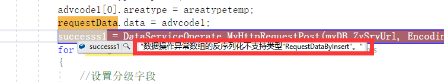
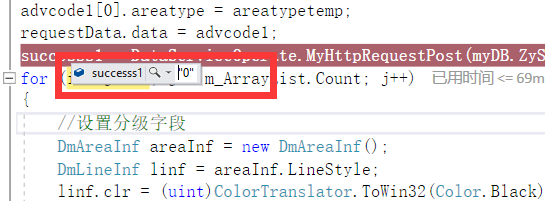

今天跑程序的时候出现错误，当我调用数据库服务插入数据的时候报错：
反序列化：“数组的反序列化不支持类型”。
经过排查后发现问题出现在数据类型不匹配上，虽然编译器不会报错，但是跑起来程序异常。
 语句如下：
```
            successs1 = DataServiceOperate.MyHttpRequestPost(myDB.ZySrvUrl, 
Encoding.UTF8.GetBytes(DataServiceOperate.getConnectString("area_rain", "insert", 
requestData)));
```
定义的变量：
```
List<area_rain> advcode1 = new List<area_rain>(); 
RequestDataByInsert<area_rain> requestData = new RequestDataByInsert<area_rain>();
```
其中的问题出在第三个参数上面，可以看到我插入值的表名是“area_rain”，如果我我们第三个参数给成一个定义为“area_rain”类型的数据，程序会报错。

新建一个变量
```
RequestDataByInsert<area_rain> requestData = new RequestDataByInsert<area_rain>();
requestData.data = advcode1;
requestData.isReturning = "0";
```
再将此变量作为参数，即：
```
successs1 = DataServiceOperate.MyHttpRequestPost(myDB.ZySrvUrl, 
Encoding.UTF8.GetBytes(DataServiceOperate.getConnectString("area_rain", "insert", 
requestData)));
```
发现操作成功

